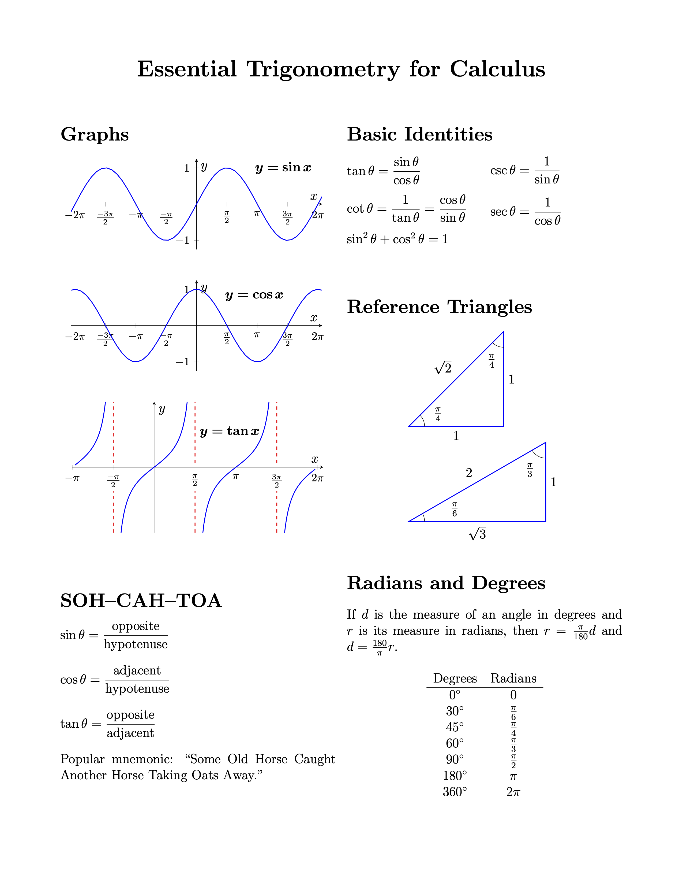
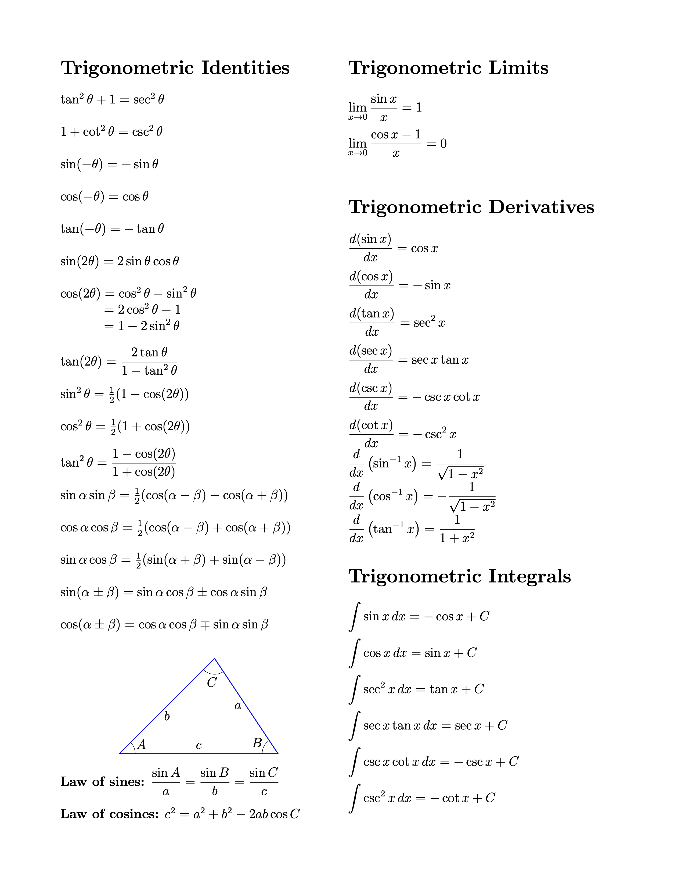
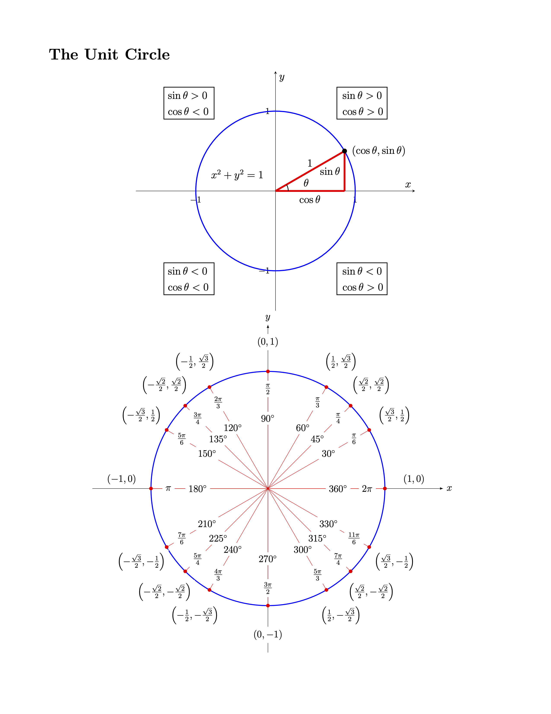

# Essential Trigonometry for Calculus

A quick-reference trigonometry guide for calculus students. Created using LaTeX and TikZ.

## Files

- `EssentialTrigForCalculus.tex`: The LaTeX source code  
- `EssentialTrigForCalculus.pdf`: Precompiled PDF  
- `images/`: Folder containing supporting image files (e.g., PNG previews, TikZ-generated figures)  

## Preview

  
  

  

## License

This work is licensed under the [Creative Commons Attribution-NonCommercial 4.0 International](https://creativecommons.org/licenses/by-nc/4.0/) license (CC BY-NC 4.0).

You may share and adapt for **non-commercial purposes**, provided attribution is given.

## About

Originally authored by **divisbyzero**, this repository makes it easier to access, reuse, and contribute improvements to a concise LaTeX trigonometry reference.
